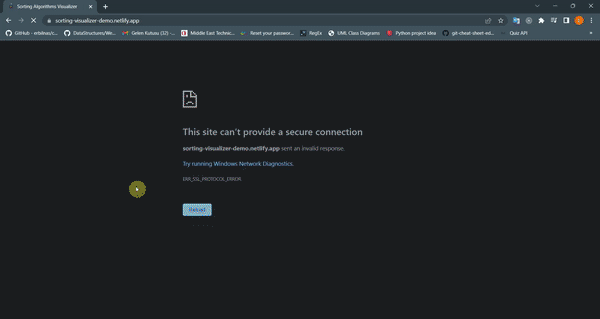

# Sorting Algorithms Visualizer

## 💻 Demo

<br>



## 📝 About

- This project is a sorting algorithms visualizer. It makes visualization of the most common sorting algorithms using randomly generated array.

## 🧱 Built With

- React js <br>
- Vanilla CSS/SASS

## ⚙️ Installation and setup instructions

1. Clone down this repo. You will need node and npm installed globally on your machine.<br><br>
   📌 Installation: <br><br>
   ```sh
   npm install
   ```
   🚀 To start server: <br><br>
   ```sh
   npm start
   ```

## 🚀 Live Application URL

- The application is deployed [here](https://sorting-visualizer-demo.netlify.app/), feel free to play with it.
